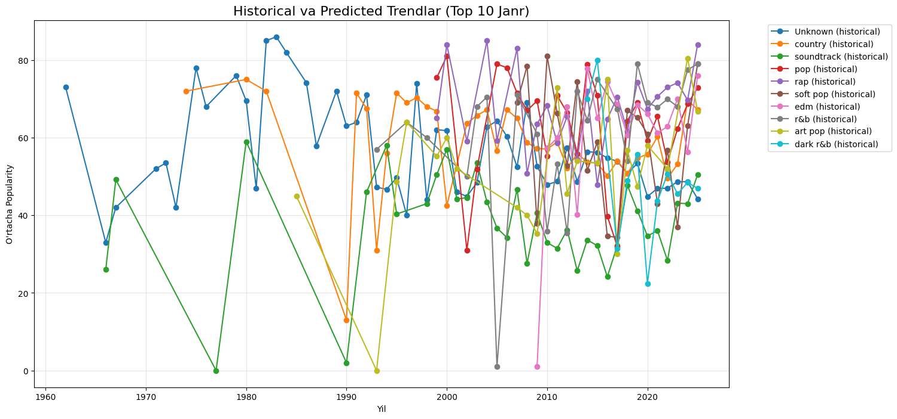
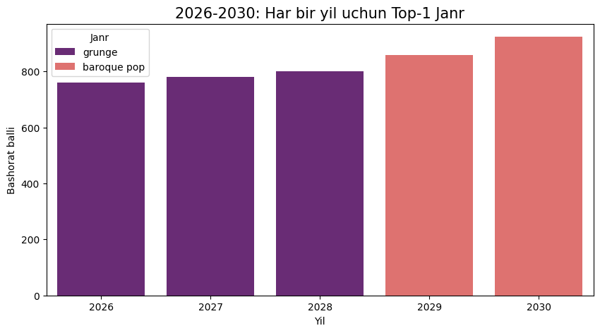

# 🎵 Sonic Oracle: Spotify Music Trends Forecast 2030

<p align="center">
  
  
  
  
  
</p>

<p align="center">
  <b>An AI-powered forecasting project that analyzes global Spotify data (2009–2025)ba dominant music genres and seasonal trends for 2026–2030.</b>
</p>

<hr />

## 🚀 Project Overview

This Jupyter Notebook uses **Linear Regression** on historical Spotify track popularity data to forecast genre dominance by season and year from **2026 to 2030**.

Key improvements:
- Filtering to the top 20 most frequent genres for realistic predictions
- Minimum 6 historical data points required per genre/season
- Popularity scores clipped to 0–100 range
- Fallback mechanism for robust results
- Enhanced visualizations combining historical and predicted trends

**Dataset**: [Spotify Global Music Dataset 2009–2025](https://www.kaggle.com/datasets/wardabilal/spotify-global-music-dataset-20092025) (automatically downloaded via `kagglehub`)

## 📊 Key Predictions (2026–2030)

- **Reggaeton** dominates global charts from **2026 to 2029**, driven by Latin music boom and viral TikTok/Reels influence.
- **Alternative Pop** rises strongly in **2030**, signaling a shift toward indie and experimental mainstream sounds.
- Seasonal highlights:
  - **Spring**: Bedroom pop and alternative pop frequently lead (Gen Z lo-fi aesthetic).
  - **Summer/Autumn/Winter**: Reggaeton consistently tops the charts.

## 📈 Visualizations

<p align="center">
  
</p>
<p align="center">
  <em>Historical popularity trends (solid lines) and predicted extensions for top genres.</em>
</p>

<p align="center">
  
</p>
<p align="center">
  <em>Predicted top-1 genre for each year: reggaeton leads until 2029, alternative pop takes over in 2030.</em>
</p>

## 🛠 Tech Stack

| Category          | Technologies                                      |
|-------------------|---------------------------------------------------|
| Language          | Python                                            |
| Data Processing   | Pandas, NumPy                                     |
| Machine Learning  | Scikit-learn (Linear Regression)                  |
| Visualization     | Matplotlib, Seaborn                               |
| Data Download     | kagglehub                                         |

## ⚙️ How to Run

1. Clone the repository:
   ```bash
   git clone https://github.com/uzbtrust/spotify-ai-predictions-2030.git
   cd spotify-ai-predictions-2030
   ```

2. Install dependencies:
   ```bash
   pip install pandas numpy scikit-learn matplotlib seaborn kagglehub
   ```

3. Open and run `main.ipynb` in Jupyter Notebook or JupyterLab:
   ```bash
   jupyter notebook main.ipynb
   ```
   - The dataset will be downloaded automatically on first run.
   - All cells can be executed sequentially.

## 📝 Notes

- Predictions are based on linear extrapolation of historical averages and are intended for exploratory/entertainment purposes.
- Results may vary slightly with dataset updates or environment differences.
- Feel free to experiment with different genre filters or models!

---

<p align="center">Developed with ❤️ by <a href="https://github.com/uzbtrust">@uzbtrust</a></p>