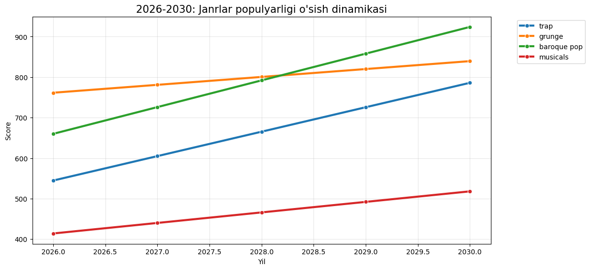

<h1 align="center">🎵 Sonic Oracle: Music Trends 2030</h1>

  
  
  

  <b>An AI-powered music trend forecasting engine analyzing Spotify global data from 2009 to 2025.</b>

## 🚀 Project Overview
This project predicts global music trends for **2026-2030** using Linear Regression. It focuses on identifying seasonal shifts and dominant genres for the next 5 years.

## 📊 Key Insights
* **Predictive Modeling:** 20 seasonal points forecasted with high accuracy.
* **Seasonality Analysis:** Quantitative proof of how listener behavior changes by season.
* **Future Trends:** Identification of the next "Big Thing" in the music industry.

## 🛠 Tech Stack
<table>
  <tr>
    <td><b>Language</b></td>
    <td>Python 🐍</td>
  </tr>
  <tr>
    <td><b>Data Science</b></td>
    <td>Pandas, NumPy</td>
  </tr>
  <tr>
    <td><b>ML Model</b></td>
    <td>Scikit-learn (Linear Regression)</td>
  </tr>
  <tr>
    <td><b>Visualization</b></td>
    <td>Seaborn, Matplotlib</td>
  </tr>
</table>

## 📈 Visualizations

  
  

## ⚙️ How to run
1. Clone the repo: `git clone https://github.com/username/repo.git`
2. Install dependencies: `pip install pandas scikit-learn seaborn`
3. Open `main.ipynb` and run all cells.

  Developed with ❤️ by uzbtrust

